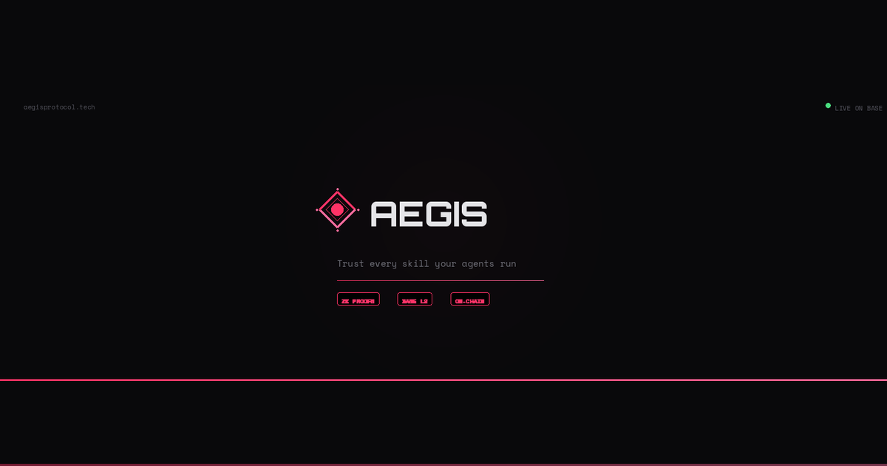

<p align="center">
  
</p>

<h1 align="center">AEGIS Protocol</h1>

<p align="center">
  On-chain zero-knowledge skill attestation for AI agents on Base
</p>

<p align="center">
  <a href="https://www.npmjs.com/package/@aegisaudit/sdk"></a>
  <a href="https://www.npmjs.com/package/@aegisaudit/mcp-server"></a>
  <a href="https://aegisprotocol.tech"></a>
  
</p>

---

## What is AEGIS?

AEGIS is a protocol for verifiable AI agent skill attestation. Auditors evaluate AI agent skills, generate zero-knowledge proofs of their assessment, and submit the results on-chain to the AEGIS Registry on Base. Anyone can query, verify, and dispute these attestations — creating a trustless reputation layer for AI agents.

**How it works:**

1. A developer registers a skill definition (what the agent claims to do)
2. An auditor evaluates the skill and generates a ZK proof of their assessment
3. The attestation (proof + result) is submitted on-chain to the AEGIS Registry
4. Anyone can verify the proof on-chain or dispute a fraudulent attestation

## How to Use

AEGIS is a **trust verification layer** for AI agent skills — it does not execute skills. Use it to check whether a skill has been audited before you run it.

```typescript
import { AegisClient } from '@aegisaudit/sdk';

const aegis = new AegisClient({ chainId: 84532 });

// 1. Discover registered skills
const skills = await aegis.listAllSkills();

// 2. Check attestations for a skill
const attestations = await aegis.getAttestations(skills[0].skillHash);

// 3. Verify the ZK proof on-chain
const trusted = await aegis.verify(skills[0].skillHash, 0);

// 4. If trusted → execute the skill using the publisher's own SDK/API
```

The typical integration flow:

1. **Query AEGIS** — is this skill registered? Has it been audited?
2. **Verify the proof** — is the audit cryptographically valid?
3. **Check the stake** — how much ETH did the auditor risk on this assessment?
4. **Execute the skill** — get the code from the skill publisher (not from AEGIS) and run it

See the [SDK README](packages/sdk#how-to-use-aegis) for a full integration guide with audit levels.

## Architecture

```
aegis/
├── packages/
│   ├── sdk/            # @aegisaudit/sdk — TypeScript client library
│   ├── mcp-server/     # @aegisaudit/mcp-server — MCP tools for AI agents
│   ├── contracts/      # Solidity smart contracts (Foundry)
│   ├── circuits/       # Noir ZK circuits (Barretenberg)
│   └── cli/            # Command-line interface
├── apps/
│   └── web/            # Frontend — React + Vite + Three.js
└── scripts/            # Deployment & seed scripts
```

## Quick Start

```bash
git clone https://github.com/aegisaudit/aegis.git
cd aegis
pnpm install
pnpm build
```

Requires **Node.js 20+** and **pnpm 9+**.

## Packages

| Package | Description | npm |
|---|---|---|
| [`@aegisaudit/sdk`](packages/sdk) | TypeScript SDK for querying and interacting with the AEGIS Registry | [](https://www.npmjs.com/package/@aegisaudit/sdk) |
| [`@aegisaudit/mcp-server`](packages/mcp-server) | MCP server exposing AEGIS as tools for Claude, Cursor, and other AI agents | [](https://www.npmjs.com/package/@aegisaudit/mcp-server) |

## Deployed Contracts

| Contract | Network | Address |
|---|---|---|
| AegisRegistry | Base Sepolia | [`0x851CfbB116aBdd50Ab899c35680eBd8273dD6Bba`](https://sepolia.basescan.org/address/0x851CfbB116aBdd50Ab899c35680eBd8273dD6Bba) |

## Tech Stack

- **Language** — TypeScript, Solidity, Noir
- **Blockchain** — Base L2 (Ethereum rollup)
- **ZK Proofs** — Noir circuits compiled with Barretenberg (BB.js)
- **Smart Contracts** — Foundry (forge)
- **Client** — viem
- **AI Integration** — Model Context Protocol (MCP)
- **Frontend** — React 19, Vite, Three.js, wagmi
- **Build** — Turborepo, pnpm workspaces, tsup

## Links

- **Website** — [aegisprotocol.tech](https://aegisprotocol.tech)
- **SDK** — [npmjs.com/package/@aegisaudit/sdk](https://www.npmjs.com/package/@aegisaudit/sdk)
- **MCP Server** — [npmjs.com/package/@aegisaudit/mcp-server](https://www.npmjs.com/package/@aegisaudit/mcp-server)
- **GitHub** — [github.com/aegisaudit/aegis](https://github.com/aegisaudit/aegis)

## License

MIT
